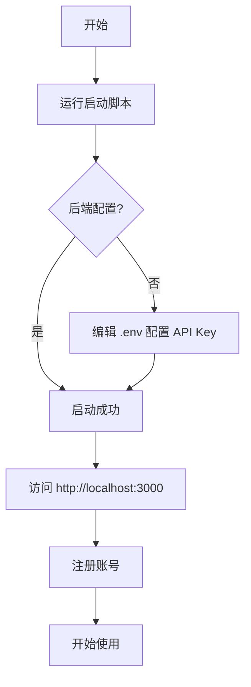
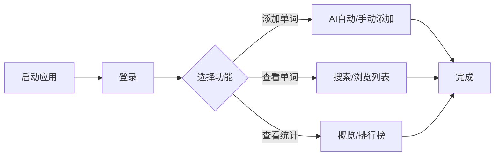

# 单词记忆助手 - 项目总览

这是一个完整的全栈应用，包含后端 API 和前端 Web 应用。

---

## 🏗️ 项目架构

```
┌─────────────────────────────────────────────────────────┐
│                    浏览器 (Browser)                       │
│                http://localhost:3000                     │
└──────────────────────┬──────────────────────────────────┘
                       │ HTTP/HTTPS
                       │ (REST API)
┌──────────────────────▼──────────────────────────────────┐
│              前端 Web 应用 (Frontend)                     │
│              Next.js 16 + React 19                       │
│                                                          │
│  ┌──────────┐  ┌──────────┐  ┌──────────┐              │
│  │ 认证表单  │  │ 单词管理  │  │ 统计展示  │              │
│  └──────────┘  └──────────┘  └──────────┘              │
│                                                          │
│              API 客户端 (axios)                          │
└──────────────────────┬──────────────────────────────────┘
                       │ JSON + JWT Token
                       │
┌──────────────────────▼──────────────────────────────────┐
│              后端 API 服务 (Backend)                      │
│              Flask 3.0 + SQLAlchemy                      │
│                                                          │
│  ┌──────────┐  ┌──────────┐  ┌──────────┐              │
│  │ 用户认证  │  │ 单词管理  │  │ 统计分析  │              │
│  └──────────┘  └──────────┘  └──────────┘              │
│                                                          │
│              Deepseek AI 服务                           │
└──────────────────────┬──────────────────────────────────┘
                       │ SQL
                       │
┌──────────────────────▼──────────────────────────────────┐
│                数据库 (Database)                         │
│                SQLite / MySQL                            │
│                                                          │
│  users | words | syllables | word_syllables             │
│  user_word_queries | user_syllable_queries              │
└─────────────────────────────────────────────────────────┘
```

---

## 📦 项目组成

### 1. 后端 API (Backend)
- **位置**: 项目根目录
- **技术栈**: Flask + SQLAlchemy + JWT
- **端口**: 5000
- **数据库**: SQLite (默认)

### 2. 前端 Web (Frontend)
- **位置**: `word-next/` 目录
- **技术栈**: Next.js + React + TypeScript
- **端口**: 3000
- **样式**: Tailwind CSS

---

## 🚀 一键启动（最简单）

### Windows 用户
```bash
# 在项目根目录双击运行
启动完整项目.bat
```

### Linux/Mac 用户
```bash
chmod +x 启动完整项目.sh
./启动完整项目.sh
```

这个脚本会：
1. ✅ 检查并启动后端 API 服务器
2. ✅ 检查并启动前端 Web 应用
3. ✅ 自动安装缺失的依赖
4. ✅ 自动创建配置文件

启动完成后：
- 🔌 **后端 API**: http://localhost:5000
- 🌐 **前端 Web**: http://localhost:3000

---

## 📚 详细文档

### 后端文档
- [README.md](./README.md) - 后端 API 完整文档
- [API使用示例.md](./API使用示例.md) - API 接口使用示例
- [QUICK_START.md](./QUICK_START.md) - 快速开始指南
- [database_design.md](./database_design.md) - 数据库设计文档

### 前端文档
- [word-next/README.md](./word-next/README.md) - 前端项目英文文档
- [word-next/README-CN.md](./word-next/README-CN.md) - 前端项目中文详细文档
- [FRONTEND_GUIDE.md](./FRONTEND_GUIDE.md) - 前端使用完整指南（本文档）

---

## 🎯 核心功能

### ✨ 用户系统
- [x] 用户注册
- [x] 用户登录
- [x] JWT 认证
- [x] 个人数据隔离

### 📝 单词管理
- [x] AI 自动获取（音标、翻译、音节）
- [x] 手动添加单词
- [x] 单词搜索
- [x] 单词列表浏览（分页）
- [x] 单词详情查看

### 📊 统计分析
- [x] 查询统计概览
- [x] 单词查询排行榜
- [x] 音节查询排行榜
- [x] 多维度数据分析

### 🎨 用户体验
- [x] 现代化 UI 设计
- [x] 响应式布局（移动端/桌面端）
- [x] 深色模式支持
- [x] 流畅动画效果
- [x] 友好的错误提示

---

## 📋 使用流程

### 第一次使用



### 日常使用



---

## 🛠️ 开发指南

### 后端开发

```bash
# 激活虚拟环境
venv\Scripts\activate  # Windows
source venv/bin/activate  # Linux/Mac

# 启动开发服务器
python start_server.py

# 运行测试
python test_api.py
```

### 前端开发

```bash
cd word-next

# 安装依赖
npm install

# 启动开发服务器
npm run dev

# 构建生产版本
npm run build

# 运行代码检查
npm run lint
```

### 修改后端端口

编辑根目录 `.env` 文件：
```env
FLASK_PORT=5001
```

### 修改前端端口

编辑 `word-next/.env.local` 文件：
```env
NEXT_PUBLIC_API_URL=http://localhost:5001/api
```

然后修改启动命令：
```bash
PORT=3001 npm run dev
```

---

## 📁 完整目录结构

```
11wordsyllable/
│
├── 后端文件 (Backend)
│   ├── app.py                    # Flask 主应用
│   ├── models.py                 # 数据库模型
│   ├── deepseek_service.py       # AI 服务
│   ├── start_server.py           # 启动脚本
│   ├── test_api.py               # API 测试
│   ├── requirements.txt          # Python 依赖
│   ├── .env                      # 环境配置（需创建）
│   ├── config_example.env        # 配置示例
│   └── word_memory.db            # SQLite 数据库（自动生成）
│
├── 前端项目 (Frontend)
│   └── word-next/
│       ├── app/                  # Next.js 应用目录
│       │   ├── page.tsx          # 主页面
│       │   ├── layout.tsx        # 根布局
│       │   └── globals.css       # 全局样式
│       ├── components/           # React 组件
│       │   ├── AuthForm.tsx      # 认证表单
│       │   ├── AddWord.tsx       # 添加单词
│       │   ├── WordList.tsx      # 单词列表
│       │   └── Statistics.tsx    # 统计展示
│       ├── lib/
│       │   └── api.ts            # API 接口封装
│       ├── .env.local            # 前端配置（需创建）
│       ├── package.json          # 依赖配置
│       └── tsconfig.json         # TypeScript 配置
│
├── 启动脚本 (Scripts)
│   ├── 启动完整项目.bat          # Windows 一键启动
│   ├── 启动完整项目.sh           # Linux/Mac 一键启动
│   ├── 启动服务器.bat            # 后端启动
│   ├── setup_venv.bat            # 虚拟环境创建
│   └── word-next/
│       ├── 启动前端.bat          # Windows 前端启动
│       └── 启动前端.sh           # Linux/Mac 前端启动
│
├── 文档 (Documentation)
│   ├── README.md                 # 后端文档
│   ├── API使用示例.md            # API 使用示例
│   ├── QUICK_START.md            # 快速开始
│   ├── FRONTEND_GUIDE.md         # 前端使用指南
│   ├── PROJECT_OVERVIEW.md       # 项目总览（本文档）
│   └── word-next/
│       ├── README.md             # 前端英文文档
│       └── README-CN.md          # 前端中文文档
│
└── 数据库 (Database)
    ├── database_design.md        # 数据库设计
    ├── create_database.sql       # SQL 创建脚本
    └── word_memory.db            # SQLite 数据库文件（运行时生成）
```

---

## 🔧 配置文件说明

### 后端配置 (`.env`)

位置：项目根目录

```env
# 必须配置
DEEPSEEK_API_KEY=your-api-key-here    # Deepseek AI 密钥

# 可选配置
JWT_SECRET_KEY=your-secret-key        # JWT 密钥
DATABASE_URL=sqlite:///word_memory.db # 数据库地址
FLASK_HOST=0.0.0.0                    # 服务器地址
FLASK_PORT=5000                       # 服务器端口
FLASK_DEBUG=True                      # 调试模式
```

### 前端配置 (`.env.local`)

位置：`word-next/` 目录

```env
# API 后端地址
NEXT_PUBLIC_API_URL=http://localhost:5000/api
```

---

## 🚨 常见问题

### 1. 启动脚本无法运行

**Windows**：
- 右键脚本 → 属性 → 解除阻止
- 以管理员身份运行

**Linux/Mac**：
```bash
chmod +x 启动完整项目.sh
```

### 2. 后端无法启动

**检查项**：
1. Python 版本（需要 3.8+）
2. 虚拟环境是否创建
3. 依赖是否安装
4. 端口 5000 是否被占用

**解决**：
```bash
# 重新创建虚拟环境
setup_venv.bat  # Windows
./setup_venv.sh # Linux/Mac
```

### 3. 前端无法启动

**检查项**：
1. Node.js 版本（需要 18+）
2. npm 是否正常
3. 依赖是否安装
4. 端口 3000 是否被占用

**解决**：
```bash
cd word-next
rm -rf node_modules .next
npm install
```

### 4. 前后端无法通信

**检查项**：
1. 后端是否正在运行
2. `.env.local` 中的 API 地址是否正确
3. 防火墙是否阻止
4. CORS 是否启用（后端已默认启用）

**测试**：
- 访问 http://localhost:5000/api/health
- 应该返回 `{"status": "healthy"}`

### 5. AI 功能不可用

**原因**：
- 未配置 `DEEPSEEK_API_KEY`
- API Key 无效或过期
- 网络连接问题

**解决**：
1. 编辑 `.env` 文件
2. 配置有效的 API Key
3. 重启后端服务
4. 或使用"手动添加"模式

---

## 📊 性能优化

### 后端优化
- [x] SQLAlchemy 查询优化
- [x] 关联查询减少 N+1 问题
- [ ] Redis 缓存（待实现）
- [ ] 数据库索引优化

### 前端优化
- [x] 组件按需加载
- [x] API 请求拦截器
- [x] 状态缓存
- [x] 图片懒加载
- [ ] Service Worker（待实现）

---

## 🔒 安全性

### 已实现
- [x] JWT Token 认证
- [x] 密码加密存储
- [x] SQL 注入防护（ORM）
- [x] XSS 防护（React 自动转义）
- [x] CORS 配置

### 待加强
- [ ] 密码强度检查
- [ ] 登录尝试次数限制
- [ ] Token 刷新机制
- [ ] HTTPS 强制（生产环境）
- [ ] API 请求频率限制

---

## 🌐 部署建议

### 开发环境
- 后端：`python start_server.py`
- 前端：`npm run dev`
- 数据库：SQLite

### 生产环境
- 后端：Gunicorn + Nginx
- 前端：Vercel / Nginx
- 数据库：PostgreSQL / MySQL
- HTTPS：Let's Encrypt
- 日志：集中式日志管理
- 监控：应用性能监控

---

## 📈 未来计划

### 功能扩展
- [ ] 单词发音功能
- [ ] 批量导入/导出
- [ ] 单词测验
- [ ] 学习进度追踪
- [ ] 生词本分类
- [ ] 社交功能（分享、评论）

### 技术升级
- [ ] PWA 支持
- [ ] 移动端 App
- [ ] 微服务架构
- [ ] GraphQL API
- [ ] WebSocket 实时通信

---

## 🤝 贡献指南

欢迎贡献代码！请遵循以下步骤：

1. Fork 项目
2. 创建功能分支 (`git checkout -b feature/AmazingFeature`)
3. 提交更改 (`git commit -m 'Add some AmazingFeature'`)
4. 推送到分支 (`git push origin feature/AmazingFeature`)
5. 开启 Pull Request

### 代码规范
- **后端**: PEP 8 (Python)
- **前端**: ESLint + Prettier (TypeScript)
- **提交**: Conventional Commits

---

## 📝 许可证

MIT License - 详见 LICENSE 文件

---

## 📞 联系方式

如有问题或建议，欢迎：
- 📧 提交 Issue
- 💬 发起 Discussion
- 🔀 提交 Pull Request

---

## 🎉 致谢

感谢以下开源项目：
- Flask - 后端框架
- Next.js - 前端框架
- React - UI 库
- SQLAlchemy - ORM
- Tailwind CSS - 样式框架
- Deepseek AI - AI 服务

---

**祝使用愉快！Happy Learning! 📚✨**

